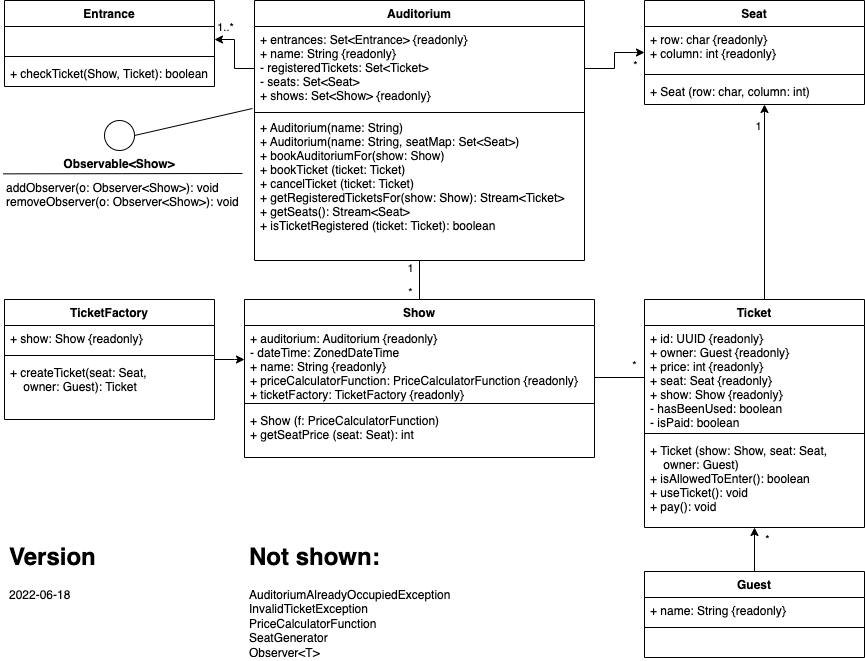

# PROG2-SEP2022-Ticketing

## Einführung
In diesem Projekt ist ein einfaches Ticketing-System für *Show*s (Vorführungen) realisiert.
Es dient als Basis für Prüfungsaufgaben in den verschiedenen Bereichen von PROG2 (concurrency, mocking, ...).

Die Funktionsweise des Systems ist in *BasicTest* "dokumentiert". 
Die Tests können mit `gradle test` ausgeführt werden.

## Klassendiagramm
